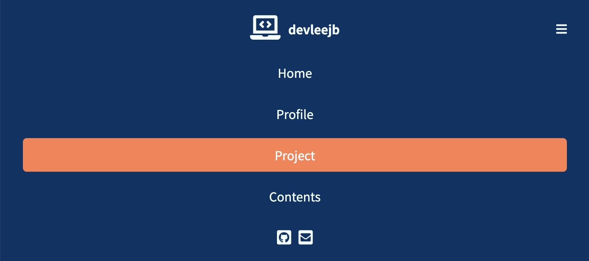

# About Repository

이 저장소는 반응형 헤더 예제 파일을 담고 있습니다.

 

## Images and Description

- 반응형 헤더의 기본 모습이다.

- 반응형 헤더의 메뉴에 커서가 올라가면 해당 메뉴의 background-color가 코랄 색으로 변경된다.

- 웹 사이트의 width가 800px 이하기 될 경우를 media query를 이용하여 반응형 헤더를 구현하였다.
- 웹 사이트의 width가 조건을 만족하면 우측 상단에 토글 버튼이 생성되고, nav 태그의 flex-direction이 column 방향으로 변경되어 컨텐츠가 세로 방향으로 배치된다. 
- 웹 사이트의 width가 800px 이상일 경우 가운데에 배치되는 ul 태그 내의 li 태그가 inline element로 배치되어 가로로 나열되지만, width가 800px보다 작아지면 li 태그가 block level element로 배치되어 세로로 나열된다.

- 오른쪽 상단의 토글 버튼을 클릭하면, 하단의 menu와 contact 아이콘이 사라진다.

